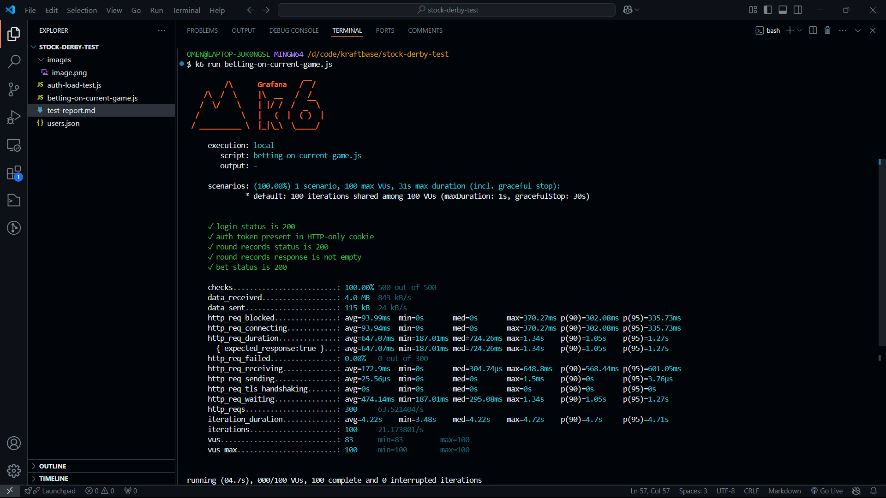
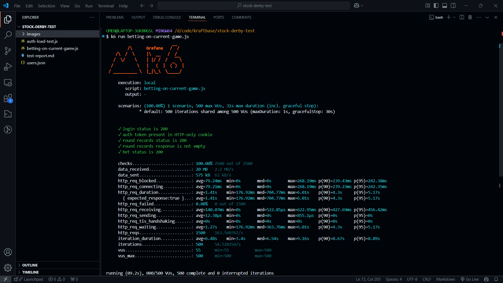

# Stock Derby Betting Flow Load Test Report

## Test Overview
**Objective:** Evaluate the performance and stability of the stock derby betting platform under concurrent user load

## Test Configuration
- **Number of Concurrent Users (VUs):** 500
- **Test Duration:** 1 second
- **Total Iterations:** 500

## Test Flow
The load test simulates a typical user interaction with the betting platform, consisting of three primary steps, step has a 1second gap in between to simulate the real user experience:
1. **User Authentication**
   - Login using randomly selected user credentials
   - Verify successful authentication
   - Retrieve HTTP-only authentication token
2. **Round Record Retrieval**
   - Fetch current round records
   - Verify successful record retrieval
3. **Bet Placement**
   - Select two markets for betting
   - Place a bet with a random amount between 1-100
   - Verify successful bet submission

## Performance Metrics

### Success Rates

| Metric | Value | Details |
|--------|-------|---------|
| Checks Passed | 100% | 2,500 out of 2,500 successful |
| Request Failure Rate | 0% | All requests processed successfully |

### Request Performance

### Request Performance
| Metric | Average | Minimum | Median | Maximum |
|--------|---------|---------|--------|---------| 
| Iteration Duration (500 Users) | 6.48s | 3.4s | 6.54s | 9.16s |
| Iteration Duration (100 Users) | 4.22s | 3.48s | 4.22s | 4.72s |

### Throughput Metrics

| Metric | Value |
|--------|-------|
| Total HTTP Requests | 1,500 |
| Total Iterations | 500 |
| Iterations per Second | 54.52 |

## Test Parameters
- **Base URL:** http://168.119.150.101/api
- **Authentication Password:** IamChanp@22
- **Bet Placement Type:** Split (STREET)
- **Bet Amount Range:** 1-100

## Execution Notes
- One-second sleep interval between authentication and round record retrieval
- Another one-second sleep interval before bet placement
- Uses k6 performance testing framework

## Key Observations
1. The test succeeded with a 100% success rate across all stages.

## Grafana K6 result

### for 100 concurrent users

### for 500 concurrent users

## Conclusion
The betting platform demonstrated stability under 500 concurrent users, with all transactions successfully processed. 